# EVSE IDS 설계 문서

<!--ScriptorStartFragment-->
<!--ScriptorEndFragment-->

## 1. 설계 목표와 범위

### 목표

*   충전기 내부/주변에서 발생하는 이벤트를 수집해 룰·FSM·레이트·무결성 기반 탐지
*   탐지 결과를 로컬 로그 + OCPP(SecurityEventNotification)로 원격 통지
*   안전에 영향 주지 않도록 제어부와 느슨하게 결합(IPC 플래그/명령)

### 범위(MVP)

*   OCPP 스택 로그 기반 이벤트 수집
*   계측(전압/전류/전력/에너지) 수집
*   충전 상태(FSM) 및 컨택터 상태 수집
*   룰 20~30개 기반 탐지 + 알림/완화(Degrade/Safe)
*   증적 로깅 + (선택) CSMS GetLog 대응을 위한 로그 번들링

* * *

## 2. 전체 아키텍처

### 프로세스 분리(권장)

*   `evse-idsd`: IDS 데몬(탐지/정책/알림/로그)
*   `evse-ctrld`: 충전 제어 데몬(컨택터/PWM/상태 관리) — 기존에 있으면 그대로
*   `ocpp-stack`: OCPP 스택 프로세스(또는 라이브러리)
*   (선택) `secc/15118 stack`: ISO 15118(PLC/SECC) 스택

### 논리 컴포넌트

1.  **Collector Layer**
    *   OCPP Log Collector
    *   EVSE Control Collector(상태/컨택터)
    *   Meter Collector
    *   Integrity Collector(FIM, time jump, reboot 등)
    *   (확장) 15118 Collector (SECC 이벤트)
2.  **Core**
    *   Event Normalizer (표준 이벤트 모델로 정규화)
    *   Detection Engine (FSM + Rule + Rate + Integrity)
    *   Alert Manager (중복 억제/쿨다운/집계)
    *   Response Manager (Warn/Degrade/Safe 정책 실행)
    *   Logger/Audit (로컬 저장, 옵션: 해시체인)
3.  **Interfaces**
    *   OCPP Notifier (SecurityEventNotification 송신)
    *   Control IPC (degrade/safe 플래그 전달)
    *   Local Ops API (CLI/REST/Unix socket)

    ```mermaid
    flowchart TB
        subgraph EXT["External"]
            CSMS["CSMS / Backend\n(OCPP Central System)"]
            SOC["SOC/SIEM (optional)"]
        end

        subgraph EVSE["EVSE (Linux SBC) - Logical Architecture"]
            direction TB
            subgraph PROD["Event Producers (Sources)"]
                direction LR
                OCPPLOG["OCPP Stack Logs\n(2.0.1 → 2.1)"]
                CTRLSTATE["Charging Control State\n(FSM/Contactor/Fault)"]
                METERDATA["Meter Measurements\n(V/I/P/Wh/Temp)"]
                INTEG["Integrity Signals\n(config/binary/cert hash)"]
                SYS["System Signals\n(reboot/disk/time jump)"]
                ISOLOG["ISO 15118 Logs/Events\n(15118-2 → 15118-20)"]
            end

            subgraph COL["Collector Layer"]
                direction LR
                C1["OCPP Log Collector"]
                C2["Control Collector"]
                C3["Meter Collector"]
                C4["Integrity Collector (FIM)"]
                C5["System Collector"]
                C6["ISO15118 Collector"]
            end

            subgraph NORM["Normalization Layer"]
                direction TB
                BUS["Event Bus / Queue"]
                ESPEC["Event Normalizer\n(EventSpec schema)"]
            end

            subgraph DET["Detection Core"]
                direction LR
                FSM["FSM Validator\n(Session State Machine)"]
                RULES["Rule Engine\n(threshold/consistency)"]
                RATE["Rate/Abuse Engine\n(window/token bucket)"]
                INTDET["Integrity Evaluator\n(FIM/time checks)"]
            end

            subgraph POLICY["Alert & Policy Layer"]
                direction TB
                AGG["Alert Manager\n(dedupe/cooldown/aggregate)"]
                RESP["Response Manager\nWarn / Degrade / Safe"]
                MAP["Policy Mapping\n(rule→action)"]
            end

            subgraph OBS["Evidence & Observability"]
                direction LR
                LOG["Logger/Audit\n(JSONL + rotate)\n(opt: hash-chain)"]
                BUNDLE["Log Bundle Builder (optional)\n(GetLog evidence)"]
                OPS["Local Ops\n(CLI/REST/Socket)"]
                METRICS["Health/Metrics\n(queue/cpu/mem)"]
            end

            subgraph ACT["Actuation & Integration"]
                direction LR
                CTRLIPC["Control IPC\n(SET_MODE / SAFE_STOP)"]
                OCPPNT["OCPP Notifier\n(SecurityEventNotification)\n(+GetLog flow optional)"]
            end

            subgraph CTRLPLANE["Charging Control Plane (Logical)"]
                direction TB
                CTRLCORE["EVSE Control Core\n(State Manager + Safety)"]
                CONTACTOR["Power Actuation\n(Contactor/PWM)"]
                SAFETY["Safety Handling\n(Fault/Lockout)"]
            end
        end

        %% ---------- Mappings / Flows ---------- %%
        %% Producers -> Collectors
        OCPPLOG --> C1
        CTRLSTATE --> C2
        METERDATA --> C3
        INTEG --> C4
        SYS --> C5
        ISOLOG --> C6

        %% Collectors -> Normalization
        C1 --> BUS
        C2 --> BUS
        C3 --> BUS
        C4 --> BUS
        C5 --> BUS
        C6 --> BUS
        BUS --> ESPEC

        %% Normalization -> Detection
        ESPEC --> FSM
        ESPEC --> RULES
        ESPEC --> RATE
        ESPEC --> INTDET

        %% Detection -> Alert/Policy
        FSM --> AGG
        RULES --> AGG
        RATE --> AGG
        INTDET --> AGG
        MAP --> RESP
        AGG --> RESP

        %% Alert -> Evidence/Observability
        AGG --> LOG
        LOG --> BUNDLE
        OPS --> METRICS

        %% Response -> Actuation/Integration
        RESP --> CTRLIPC
        RESP --> OCPPNT

        %% Actuation -> Control plane
        CTRLIPC --> CTRLCORE
        CTRLCORE --> CONTACTOR
        CTRLCORE --> SAFETY

        %% Remote notifications
        OCPPNT --> CSMS
        CSMS --> SOC

        %% Optional evidence pull (conceptual)
        CSMS -. "GetLog (optional)" .-> BUNDLE
        BUNDLE -. "upload status via OCPP" .-> CSMS
    ```
* * *

## 3. 런타임 데이터 흐름

1.  Collector들이 이벤트를 수집 → Event Bus(내부 큐) 로 push
2.  Normalizer가 소스별 이벤트를 표준 이벤트(EventSpec) 로 변환
3.  Detection Engine이 이벤트 처리
    *   FSM 업데이트/검증
    *   룰 평가(임계/일관성/레이트)
    *   무결성 검사 결과 반영
4.  Alert 생성 시:
    *   로컬 로그 기록
    *   필요 시 OCPP SecurityEventNotification 전송
    *   정책에 따라 Degrade/Safe 실행(IPC로 제어부 전달)
5.  CSMS가 증적 요구 시(선택):
    *   GetLog 요청 수신 → 로그 번들 생성/업로드 → LogStatusNotification 보고

    ```mermaid
    flowchart TB
        subgraph SRC["Sources"]
            OCPPLOG["OCPP Stack Logs"]
            CTRL["Control (FSM/Contactor/Fault)"]
            METER["Meter (V/I/P/Wh)"]
            INTEG["Integrity (FIM/Config/Binary/Cert)"]
            SYS["System (Time jump/Disk/Reboot)"]
            ISO["ISO 15118 Events/Logs"]
        end

        subgraph COL["Collectors"]
            C1["OCPP Log Collector"]
            C2["Control Collector"]
            C3["Meter Collector"]
            C4["Integrity Collector"]
            C5["System Collector"]
            C6["ISO15118 Collector"]
        end

        %% Wiring sources -> collectors
        OCPPLOG --> C1
        CTRL --> C2
        METER --> C3
        INTEG --> C4
        SYS --> C5
        ISO --> C6

        %% ---- Event bus ----
        BUS["Event Bus (Internal Queue)\nCollectors push events"]
        C1 --> BUS
        C2 --> BUS
        C3 --> BUS
        C4 --> BUS
        C5 --> BUS
        C6 --> BUS

        %% ---- Normalization ----
        NORM["Normalizer\n(source-specific → EventSpec)"]
        BUS --> NORM
        ESPEC["Standard Event\n(EventSpec)"]
        NORM --> ESPEC

        %% ---- Detection Engine ----
        subgraph DET["Detection Engine"]
            FSM["FSM Update / Validate"]
            RULE["Rule Evaluation\n(threshold / consistency / rate)"]
            INTCHK["Apply Integrity Results\n(FIM/time/etc.)"]
            DECIDE["Decision\n(trigger? severity? policy?)"]
        end
        ESPEC --> FSM
        ESPEC --> RULE
        ESPEC --> INTCHK
        FSM --> DECIDE
        RULE --> DECIDE
        INTCHK --> DECIDE

        %% ---- Alert / Actions ----
        subgraph ACT["On Alert (if triggered)"]
            ALERT["Alert Create/Update\n(dedupe/cooldown)"]
            LOG["Local Log Write\n(JSONL/Audit)"]
            OCPPSE["Send via OCPP\nSecurityEventNotification (if needed)"]
            IPC["Execute Policy\nDegrade/Safe via Control IPC"]
        end
        DECIDE -->|Triggered| ALERT
        ALERT --> LOG
        ALERT --> OCPPSE
        ALERT --> IPC

        %% ---- Remote (CSMS) ----
        CSMS["CSMS / Backend"]
        OCPPSE --> CSMS

        %% ---- Optional Evidence Flow ----
        subgraph EVID["Optional: Evidence on CSMS Request"]
            GETLOG["Receive GetLog Request"]
            BUNDLE["Build Log Bundle\n(IDS log + OCPP log + syslog)"]
            UPLOAD["Upload Logs"]
            STATUS["Report via OCPP\nLogStatusNotification"]
        end
        CSMS -->|GetLog optional| GETLOG
        GETLOG --> BUNDLE
        BUNDLE --> UPLOAD
        UPLOAD --> STATUS
        STATUS --> CSMS

        %% ---- No alert path ----
        DECIDE -->|Not triggered| NOALERT["No Alert\n(continue processing)"]
    ```
* * *

## 4. 표준 이벤트 모델(EventSpec)

### Event 공통 헤더

*   `ts` (monotonic+realtime 혼합 권장: realtime는 보고용, monotonic은 판정용)
*   `source` (OCPP / CTRL / METER / SYS / INT / ISO15118)
*   `type` (STATE, CONTACTOR, POWER\_SAMPLE, OCPP\_ACTION, CFG\_CHANGE, INTEGRITY\_FAIL, TIME\_JUMP, REBOOT…)
*   `connector_id`, `session_id` (가능 시)
*   `severity_hint` (optional)
*   `payload` (타입별 최소 필드)

### Alert 모델

*   `alert_id`, `rule_id`, `severity(INFO/WARN/CRITICAL)`
*   `summary`, `first_seen`, `last_seen`, `count`
*   `evidence` (핵심 필드 스냅샷)

* * *

## 5. 수집기 설계

### 5.1 OCPP Log Collector (2.0.1 기반)

전제: “OCPP 스택 로그”를 파싱해서 Action/결과/핵심 필드를 추출

*   입력:
    *   파일(tail -F), journald, 또는 스택이 제공하는 callback 로그
*   추출 대상:
    *   Action: BootNotification, Heartbeat, Authorize, TransactionEvent, StatusNotification
    *   고위험: Reset, ChangeConfiguration, SetNetworkProfile, UpdateFirmware, GetLog 관련
*   출력 이벤트 예:
    *   `OCPP_ACTION{action, direction(REQ/RESP), status, request_id, idToken_hash, src_ip(가능시)}`

확장 포인트(OCPP 2.1)

Action 집합/필드가 늘어날 수 있으니 “파서 규칙 + 매핑 테이블”을 설정으로 분리.

### 5.2 Control Collector

*   충전 제어부(evse-ctrld)가 보유한 내부 상태를 이벤트로 발행
    *   state change, contactor on/off, fault reason, stop reason
*   방식:
    *   Unix domain socket(pub), DBus, 또는 local REST(루프백)
*   출력:
    *   `STATE_CHANGE{from,to,reason}`
    *   `CONTACTOR{state, result}`

### 5.3 Meter Collector

*   Modbus/serial/내장 ADC 등으로부터 샘플링
*   출력:
    *   `POWER_SAMPLE{V,I,P,Wh}` + `stats(window)`는 IDS가 내부 계산

### 5.4 Integrity Collector (FIM)

*   감시 대상:
    *   설정 파일, 인증서/CA, 중요 바이너리(선택)
*   메커니즘:
    *   주기적 해시 + 변경 시점 이벤트화
    *   “승인된 관리 세션” 태그를 받을 수 있으면(예: 관리 API에서) 오탐 감소
*   출력:
    *   `INTEGRITY_CHANGE{path, old_hash, new_hash, actor(optional)}`

### 5.5 ISO 15118 Collector(확장)

15118-2에서 시작, 15118-20 중심이 될 것이므로:

*   SECC 로그/이벤트에서 최소한 아래를 뽑아 EventSpec으로 정규화
    *   TLS 핸드셰이크 실패/버전/암호군
    *   인증서 체인/계약 인증서 검증 실패
    *   세션 협상 실패(프로파일/파라미터)
    *   (20) bidirectional 관련 모드 전환, 정책 거부 등
*   출력:
    *   `ISO15118_EVENT{category, code, details}`

* * *

## 6. 탐지 엔진 설계

### 6.1 FSM 모듈

*   상태 집합(예시):
    *   IDLE → CONNECTED → AUTHORIZED → CHARGING → STOPPING → IDLE (+ FAULT)
*   허용 전이 테이블 기반 검증
*   위반 시:
    *   `EVSE-FSM-001` 같은 룰 트리거
*   주의:
    *   OCPP TransactionEvent/StatusNotification과 제어부 상태가 불일치할 수 있어 “source priority” 정책 필요
    *   권장: **제어부 상태를 권위(authoritative)**로 두고 OCPP는 보조 증거

### 6.2 Rule 모듈(임계/일관성)

*   전압/전류/전력 범위
*   dP/dt 급변
*   컨택터 상태 vs 전류/전력 일관성
*   에너지 카운터 역행/점프

### 6.3 Rate 모듈(윈도우 카운팅/토큰버킷)

*   Authorize 실패 반복
*   RemoteStart/Stop 폭주
*   고위험 명령(Reset/ChangeConfiguration/UpdateFirmware) 반복

### 6.4 Alert Aggregation(중복 억제)

*   (`rule_id`, `connector_id`, `session_id`, `key_fields`)로 fingerprint
*   쿨다운: 같은 지문은 X초 내 1회만 원격 전송, 로컬은 카운트만 증가

* * *

## 7. 대응(Response) 설계

### 7.1 정책 레벨

*   **Warn**: 로컬 기록 + OCPP 알림(선택)
*   **Degrade**:
    *   관리 기능 잠금(설정 변경/업데이트/리셋) 플래그 ON
    *   커넥터 쿨다운(새 세션 시작 제한)
    *   OCPP 고위험 요청 처리 정책 강화(가능하면 스택/CSMS와 협의)
*   **Safe**:
    *   충전 중이면 정상 절차로 종료 요청 → 컨택터 OFF → FAULT/LOCK 상태 진입

### 7.2 제어부 연동(IPC)

*   Unix socket 기반의 단순 프로토콜 추천
    *   `SET_MODE degrade=1 safe=0 reason=RULE_ID`
    *   `GET_MODE`
    *   `REQUEST_SAFE_STOP connector_id session_id reason`
*   제어부는 IDS 플래그를 “정책 입력”으로만 받아서 실제 동작은 안전하게 수행

* * *

## 8. 원격 알림 설계(OCPP 사용)

### 8.1 즉시 알림: SecurityEventNotification

*   IDS Alert(특히 WARN/CRITICAL)를 OCPP `SecurityEventNotification`로 전송
*   `eventType`은 룰 ID 기반(allowlist) 권장
    *   예: `EVSE-INT-001`, `EVSE-FSM-001` …
*   필수 포함 권장:
    *   `rule_id`, `severity`, `connector_id`, `session_id`(가능 시), 요약, 주요 수치(축약)

### 8.2 증적 제공: GetLog/LogStatusNotification(선택)

*   CSMS 요청 시:
    *   ids 로그 + ocpp stack 로그 + syslog(필터링) 번들 생성
    *   업로드 진행/결과를 LogStatusNotification으로 보고

> <!--ScriptorStartFragment-->
> 핵심: “알림은 OCPP로 가능”, “증적은 CSMS가 당겨가는 방식이 운영상 좋음”
> <!--ScriptorEndFragment-->

* * *

## 9. 로깅/저장 설계

### 로컬 로그

*   IDS 이벤트/알림:
    *   JSON Lines 권장(파싱/전송 쉬움)
*   로그 롤링:
    *   `logrotate` 또는 내부 링버퍼(파일+사이즈 제한)
*   옵션(강화):
    *   해시체인으로 로그 무결성(나중에 포렌식 신뢰도↑)

* * *

## 10. 설정/정책 구조

### config.yaml 예시 구조(개념)

*   `collectors`:
    *   `ocpp_log`: path, format, parse\_rules
    *   `meter`: device, interval\_ms
    *   `ctrl_ipc`: socket\_path
    *   `integrity`: watch\_paths, interval\_s
*   `detection`:
    *   `fsm`: states, transitions
    *   `thresholds`: V/I/P limits, dpdt, zero\_power\_timeout
    *   `rate_limits`: authorize\_fail, remote\_start, reset, update\_fw
    *   `dedup`: cooldown\_s, fingerprint\_fields
*   `response`:
    *   `mapping`: rule\_id → action(Warn/Degrade/Safe)
    *   `degrade`: duration\_s, lock\_admin\_features
    *   `safe`: require\_confirm(false for CRITICAL), stop\_sequence\_profile
*   `ocpp_notify`:
    *   enabled, min\_severity, eventType\_allowlist, payload\_template

* * *

## 11. 배포/운영(systemd)

*   `evse-idsd.service`
    *   `After=network.target ocpp-stack.service evse-ctrld.service`
    *   `Restart=on-failure`
    *   (선택) `MemoryMax/CPUQuota`로 리소스 캡
*   권한:
    *   로그 읽기(journald), meter 디바이스 접근, 설정 파일 읽기 최소 권한
    *   가능한 rootless + capability 최소화

* * *

## 12. 확장 포인트 정리

*   OCPP 2.1 확장: Action 매핑/파서 룰만 추가하면 Core는 그대로
*   ISO 15118-20 중심화:
    *   SECC 이벤트를 EventSpec으로 정규화만 하면 룰 추가로 흡수 가능
*   다른 임베디드 시스템 재사용:
    *   Collector만 교체하고 Core/Policy/Response는 공통으로 유지

# 참고

## 시스템의 블럭다이어그램

```mermaid
flowchart TB
  %% =========================
  %% EVSE IDS System Block Diagram (Basic Design)
  %% Linux SBC, OCPP 2.0.1 baseline (extend to 2.1), ISO 15118-2 start (shift to 15118-20)
  %% =========================

  subgraph LinuxSBC["Linux SBC (EVSE)"]
    direction TB

    %% ---- External / Peer Processes ----
    subgraph Peer["Peer Processes / Stacks"]
      direction TB
      OCPP["OCPP Stack\n(2.0.1 baseline → 2.1)"]
      SECC["ISO 15118 Stack (SECC/PLC)\n(15118-2 start → 15118-20)"]
      CTRL["EVSE Control Daemon\n(evse-ctrld)"]
      METER["Meter Driver/Service\n(Modbus/ADC/etc.)"]
      SYS["OS Services\n(systemd, journald, syslog, NTP)"]
    end

    %% ---- IDS Daemon ----
    subgraph IDS["EVSE IDS Daemon\n(evse-idsd)"]
      direction TB

      subgraph COL["Collector Layer"]
        direction TB
        OCPPL["OCPP Log Collector\n(journald/file tail)"]
        CTRLC["Control Collector\n(IPC subscribe)"]
        METC["Meter Collector\n(periodic sampling)"]
        INTC["Integrity Collector (FIM)\n(hash watch)"]
        SYSC["System Collector\n(reboot/disk/time jump)"]
        ISOCC["ISO15118 Collector\n(SECC logs/events)"]
      end

      BUS["Event Bus / Queue\n(in-proc / Unix socket)"]
      NORM["Event Normalizer\n→ EventSpec"]

      subgraph CORE["Detection & Policy Core"]
        direction TB
        FSM["FSM Validator\n(Session State Machine)"]
        RULE["Rule Engine\n(threshold/consistency)"]
        RATE["Rate Engine\n(window/token bucket)"]
        AGG["Alert Manager\n(dedupe/cooldown/aggregate)"]
        RESP["Response Manager\n(Warn/Degrade/Safe)"]
      end

      LOG["Logger & Audit\n(JSONL + rotate)\n(optional hash-chain)"]

      subgraph IFACE["Interfaces"]
        direction TB
        OCPPNT["OCPP Notifier\n(SecurityEventNotification)\n(+GetLog flow optional)"]
        CTRLIPC["Control IPC Client\n(SET_MODE / SAFE_STOP)"]
        OPS["Local Ops API\n(Unix socket/REST/CLI)"]
        BUNDLE["Log Bundle Builder (optional)\n(GetLog evidence)"]
      end
    end

    %% ---- Data flows into IDS ----
    OCPP -->|"OCPP stack logs"| OCPPL
    SECC -->|"SECC/PLC logs/events"| ISOCC
    CTRL -->|"state/contactor/fault IPC"| CTRLC
    METER -->|"V/I/P/Wh samples"| METC
    SYS -->|"journald/syslog/NTP stats"| SYSC
    SYS -->|"config/binary paths"| INTC

    %% ---- Collector -> Core pipeline ----
    OCPPL --> BUS
    CTRLC --> BUS
    METC --> BUS
    INTC --> BUS
    SYSC --> BUS
    ISOCC --> BUS

    BUS --> NORM
    NORM --> FSM
    NORM --> RULE
    NORM --> RATE

    FSM --> AGG
    RULE --> AGG
    RATE --> AGG

    AGG --> LOG
    AGG --> RESP

    %% ---- Response -> Interfaces ----
    RESP --> OCPPNT
    RESP --> CTRLIPC

    %% ---- Evidence / ops ----
    LOG --> BUNDLE
    OPS --> IDS
  end

  %% ---- External Backend ----
  subgraph Backend["CSMS / Backend"]
    direction TB
    CSMS["CSMS\n(OCPP Central System)"]
  end

  %% ---- External flows ----
  OCPPNT -->|"OCPP outbound\n(SecurityEventNotification)"| OCPP
  OCPP -->|"OCPP uplink"| CSMS

  CSMS -->|"OCPP inbound\n(GetLog request optional)"| OCPP
  OCPP -->|"Log bundle request (optional)"| BUNDLE
  BUNDLE -->|"bundle path/hash"| OCPP
  OCPP -->|"upload + LogStatusNotification"| CSMS

  %% ---- Control coupling ----
  CTRLIPC -->|"IPC cmd\n(degrade/safe_stop)"| CTRL
```




## 룰 목록 & 매핑표

> <!--ScriptorStartFragment-->
> Severity 기준(권장)
>
> *   INFO: 운영 참고/징후
> *   WARN: 공격/오용 가능성 높음(완화 권장)
> *   CRITICAL: 안전/금전/서비스 영향 큼(세이프 대응 고려)
>
> <!--ScriptorEndFragment-->

| RuleID        | 룰명                     | 트리거 조건(Trigger)                                         | 증거 필드(Evidence)                                      | Severity   | 권장 대응                           |
| :------------ | :----------------------- | :----------------------------------------------------------- | :------------------------------------------------------- | :--------- | :---------------------------------- |
| EVSE-FSM-001  | AUTH 없이 CHARGING 진입  | 상태 전이가 `CONNECTED/IDLE → CHARGING` 등, `AUTHORIZED` 단계 없이 진입 | `ts`, `session_id`, `prev_state`, `new_state`, `auth_flag`, `connector_id` | CRITICAL   | Safe(안전정지) + 원격알림           |
| EVSE-FSM-002  | STOPPING 없이 IDLE로 점프 | `CHARGING → IDLE` 직행(정상 종료 절차 누락)                  | `ts`, `session_id`, `prev_state`, `new_state`, `stop_reason` | WARN       | Degrade(조사 플래그)                |
| EVSE-FSM-003  | Start/Stop 반복(릴레이 수명/DoS) | N초 내 StartTx/StopTx 또는 상태 변화가 임계 횟수 초과          | `ts`, `session_id`, `window`, `count`, `connector_id`      | WARN       | Degrade(레이트 제한/쿨다운)         |
| EVSE-FSM-004  | 장시간 CONNECTED 정체    | 케이블 연결 후 `AUTHORIZED`로 못 가고 T초 이상 정체(브루트포스/장애) | `ts`, `connector_id`, `state_dwell_time`                 | INFO/WARN  | Warn(운영 알림)                     |
| EVSE-PWR-001  | 전압 범위 위반           | V가 min/max 범위 밖                                          | `ts`, `connector_id`, `V`, `limits`                      | CRITICAL   | Safe                                |
| EVSE-PWR-002  | 전류 범위 위반           | I가 min/max 범위 밖                                          | `ts`, `connector_id`, `I`, `limits`                      | CRITICAL   | Safe                                |
| EVSE-PWR-003  | 전력 급변(dP/dt)         | ΔP/Δt가 임계치 초과가 연속 발생                              | `ts`, `connector_id`, `P`, `prev_P`, `dPdt`, `threshold`   | WARN/CRITICAL | Degrade, 반복 시 Safe               |
| EVSE-PWR-004  | 컨택터 OFF인데 전력/전류 감지 | contactor=OFF인데 I 또는 P가 임계 이상                       | `ts`, `connector_id`, `contactor_state`, `I`, `P`          | CRITICAL   | Safe + Fault 로깅                   |
| EVSE-PWR-005  | 에너지 카운터 역행/점프  | Wh가 감소하거나 비정상 점프                                  | `ts`, `connector_id`, `Wh`, `prev_Wh`, `delta`             | WARN       | Degrade(과금/정산 플래그)           |
| EVSE-PWR-006  | 충전 중 ‘0전력’ 지속     | CHARGING 상태인데 P≈0이 T초 이상(미터/라인/제어 이상)        | `ts`, `session_id`, `P_series_stats`, `dwell`              | WARN       | Degrade(재측정/세션 점검)           |
| EVSE-OCPP-001 | BootNotification 실패 반복 | 부팅 직후 BootNotification 실패가 N회 이상                   | `ts`, `reason`, `count`, `response_code`                 | WARN       | Warn + 원격알림                     |
| EVSE-OCPP-002 | Heartbeat 지연/결손      | Heartbeat 미수신 또는 RTT/간격이 임계 초과                     | `ts`, `expected_interval`, `last_seen`, `rtt`              | INFO/WARN  | Warn                                |
| EVSE-OCPP-003 | Authorize 실패 반복      | 동일 idTag/동일 IP 등에서 실패가 N회/윈도우 초과              | `ts`, `idTag_hash`, `src_ip`, `fail_count`               | WARN       | Degrade(해당 주체 쿨다운)           |
| EVSE-OCPP-004 | StartTransaction 거부 반복 | StartTx가 연속 거부(구성/정책 변화 의심)                     | `ts`, `connector_id`, `reject_count`, `reason`             | WARN       | Warn                                |
| EVSE-OCPP-005 | RemoteStartTransaction 폭주 | RemoteStartTx 요청이 N회/윈도우 초과                         | `ts`, `src`, `count`, `connector_id`                     | WARN       | Degrade(레이트 제한)                |
| EVSE-OCPP-006 | RemoteStopTransaction 오용 | 정상 종료 조건 없이 RemoteStopTx 다발                        | `ts`, `session_id`, `src`, `count`                       | WARN       | Degrade                             |
| EVSE-OCPP-007 | Reset 요청 탐지(고위험)  | Reset(Soft/Hard) 요청 수신                                   | `ts`, `reset_type`, `src`, `request_id`                  | CRITICAL   | Degrade(관리 잠금) + 운영 승인 필요 |
| EVSE-OCPP-008 | ChangeConfiguration(고위험 키) | allowlist 밖 key 변경 또는 빈번한 변경                       | `ts`, `key`, `old`, `new`, `src`                         | CRITICAL   | Degrade + 변경 차단(가능 시)        |
| EVSE-OCPP-009 | SetNetworkProfile/DNS 변경 | 네트워크 프로파일 변경 시도 또는 DNS/Proxy 변경              | `ts`, `old_net`, `new_net`, `src`                        | CRITICAL   | Degrade + 즉시 알림                 |
| EVSE-OCPP-010 | UpdateFirmware 요청 탐지 | UpdateFirmware 이벤트 수신(다운로드 URL 포함)                | `ts`, `url`, `retrieve_date`, `src`                      | CRITICAL   | Degrade(업데이트 잠금) + 검증 절차  |
| EVSE-INT-001  | 설정 파일 무결성 변경    | 해시가 변경되었는데 “승인된 관리 세션” 아님                  | `ts`, `file`, `old_hash`, `new_hash`, `actor`              | CRITICAL   | Degrade + 원격알림                  |
| EVSE-INT-002  | 중요 바이너리 무결성 변경 | `/usr/bin/...` 등 중요 실행파일 해시 변경                   | `ts`, `path`, `old_hash`, `new_hash`                     | CRITICAL   | Safe(서비스 중단 고려)              |
| EVSE-INT-003  | 시간 급변(로그/검증 우회) | NTP/시각이 임계 이상 점프(±Δt)                               | `ts`, `old_time`, `new_time`, `delta`, `ntp_src`           | WARN       | Degrade + 시간 고정/재동기          |
| EVSE-SYS-001  | 재부팅/프로세스 크래시 폭주 | N분 내 reboot 또는 IDS/충전 프로세스 재시작 다발              | `ts`, `count`, `reason`, `service_name`                  | WARN/CRITICAL | Warn, 반복 시 Safe(락다운)          |
| EVSE-SYS-002  | 디스크/로그 고갈 징후    | 로그 파티션 사용률 임계 초과(DoS)                            | `ts`, `usage`, `path`                                    | WARN       | Degrade(로그 레이트 제한/정리)      |

* * *

## 증거 필드(Evidence) 표준화 제안 (로그/알림 공통 스키마)

룰이 많아질수록 “증거 필드”를 표준화하면 운영/연동이 쉬워져.

*   **공통**: `ts`, `rule_id`, `severity`, `device_id`, `connector_id`, `session_id`, `src`(OCPP/METER/CTRL/SYS), `summary`
*   **OCPP 관련**: `ocpp_action`, `request_id`, `idTag_hash`, `src_ip`, `response_code`, `reason`, `url`
*   **전력/계측**: `V`, `I`, `P`, `Wh`, `contactor_state`, `sample_window_stats`
*   **무결성**: `path`, `old_hash`, `new_hash`, `actor`, `change_channel`
*   **시스템**: `service_name`, `restart_count`, `disk_usage`, `ntp_src`, `time_delta`

* * *

## 대응 정책(운영 친화 기본값)

*   **Warn**: 로컬 로그 + 원격 알림(가능 시) + “운영 점검 필요” 표시
*   **Degrade**: (1) 관리/고위험 기능 잠금(설정변경/업데이트/리셋) (2) OCPP 요청 레이트 제한 강화 (3) 커넥터 쿨다운
*   **Safe**: 충전 중이면 정상 절차로 Stop → 컨택터 OFF → Fault/Lock (세션 종료 이유 기록)
