# 클래스 다이어그램 (MermaidJS)

```mermaid
classDiagram
    direction LR

    class EvseIdsDaemon {
      +start() int
      +stop() void
      +reloadConfig() void
      -ConfigManager config
      -EventBus bus
      -Normalizer normalizer
      -DetectionEngine detector
      -AlertManager alertMgr
      -ResponseManager respMgr
      -Logger logger
      -HealthMonitor health
      -CollectorManager collectors
      -OpsServer ops
      -ControlIpcClient ctrlIpc
      -OcppNotifierClient ocppNotifier
      -LogBundleBuilder bundleBuilder
    }

    class ConfigManager {
      +load(path) Config
      +validate(cfg) bool
      +get() Config
      +watchChanges() void
      +reload() Config
      -Config current
    }

    class Config {
      +collectors: CollectorConfig
      +detection: DetectionConfig
      +alert: AlertConfig
      +response: ResponseConfig
      +ocppNotify: OcppNotifyConfig
    }

    class CollectorManager {
      +init(cfg) void
      +startAll() void
      +stopAll() void
      +getCollectors() List~ICollector~
      -collectors List~ICollector~
    }

    class ICollector {
      <<interface>>
      +start(bus) void
      +stop() void
      +name() string
      +health() CollectorHealth
    }

    class OcppLogCollector {
      +start(bus) void
      +stop() void
      -OcppLogParser parser
      -LogSource source
    }
    class ControlCollector {
      +start(bus) void
      +stop() void
      -CtrlSubscriber subscriber
    }
    class MeterCollector {
      +start(bus) void
      +stop() void
      -MeterReader reader
      -Timer timer
    }
    class IntegrityCollector {
      +start(bus) void
      +stop() void
      -FimScanner scanner
      -Timer timer
    }
    class SystemCollector {
      +start(bus) void
      +stop() void
      -SystemProbe probe
      -Timer timer
    }
    class Iso15118Collector {
      +start(bus) void
      +stop() void
      -Iso15118Parser parser
      -LogSource source
    }

    ICollector <|.. OcppLogCollector
    ICollector <|.. ControlCollector
    ICollector <|.. MeterCollector
    ICollector <|.. IntegrityCollector
    ICollector <|.. SystemCollector
    ICollector <|.. Iso15118Collector

    class EventBus {
      +publish(raw: RawEvent) bool
      +tryPop() RawEvent?
      +depth() int
      +drops() int
      -queue MPSCQueue
      -dropPolicy DropPolicy
    }

    class RawEvent {
      +schemaVer string
      +eventId string
      +tsRealtime string
      +tsMonoMs long
      +source SourceType
      +eventType string
      +connectorId int?
      +sessionId string?
      +severityHint Severity?
      +payload map
    }

    class Normalizer {
      +normalize(raw: RawEvent) EventSpec?
      -UnitConverter unit
      -EnumMapper enums
    }

    class EventSpec {
      +eventId string
      +tsRealtime string
      +tsMonoMs long
      +source SourceType
      +type EventType
      +connectorId int?
      +sessionId string?
      +data EventData
    }

    class EventData {
      <<abstract>>
    }
    class OcppActionData {
      +action string
      +direction string
      +status string
      +idTokenHash string?
      +fields map
    }
    class StateChangeData {
      +prevState string
      +newState string
      +reason string
      +faultCode string?
    }
    class ContactorData {
      +state string
      +result string
      +reason string
    }
    class PowerSampleData {
      +v_mV int
      +i_mA int
      +p_mW int
      +wh long
      +temp_c_x10 int?
      +quality string
    }
    class IntegrityChangeData {
      +path string
      +objectType string
      +oldHash string
      +newHash string
      +hashAlg string
      +changeChannel string
      +actor string?
    }
    class SystemSignalData {
      +signal string
      +detail map
    }
    class Iso15118EventData {
      +standard string
      +phase string
      +code string
      +detail map
    }

    EventData <|-- OcppActionData
    EventData <|-- StateChangeData
    EventData <|-- ContactorData
    EventData <|-- PowerSampleData
    EventData <|-- IntegrityChangeData
    EventData <|-- SystemSignalData
    EventData <|-- Iso15118EventData

    class DetectionEngine {
      +process(e: EventSpec) List~AlertCandidate~
      -FsmValidator fsm
      -RuleEngine rules
      -RateLimiter rate
      -IntegrityEvaluator integrity
      -RuntimeContext ctx
    }

    class RuntimeContext {
      +connectors Map~int, ConnectorContext~
      +rates RateContext
      +integrity IntegrityContext
      +update(e) void
    }

    class ConnectorContext {
      +fsmState string
      +contactorState string
      +currentSessionId string?
      +meterStats SlidingStats
      +lastPower PowerSampleData?
      +lastSampleMonoMs long
    }

    class SlidingStats {
      +update(p_mW, tsMonoMs) void
      +avgP() int
      +maxP() int
      +dpdtMax() float
      +zeroPowerDurationMs() long
    }

    class FsmValidator {
      +onEvent(e, ctx) AlertCandidate?
      -transitionTable map
    }

    class RuleEngine {
      +onEvent(e, ctx) List~AlertCandidate~
      -rulesByType Map~EventType, List~IRule~~
    }

    class IRule {
      <<interface>>
      +id() string
      +evaluate(e, ctx) AlertCandidate?
    }

    class RateLimiter {
      +onEvent(e, ctx) List~AlertCandidate~
      +hit(key, limit, windowMs) bool
      -stores Map~string, WindowCounter~
    }

    class WindowCounter {
      +add(tsMonoMs) void
      +countWithin(windowMs, nowMs) int
    }

    class IntegrityEvaluator {
      +onEvent(e, ctx) AlertCandidate?
    }

    class AlertCandidate {
      +ruleId string
      +severity Severity
      +summary string
      +connectorId int?
      +sessionId string?
      +evidence map
      +tsMonoMs long
    }

    class AlertManager {
      +ingest(c: AlertCandidate) Alert?
      +dedupeKey(c) string
      +shouldNotifyRemote(a) bool
      -cooldown CooldownStore
      -active Map~string, Alert~
    }

    class Alert {
      +alertKey string
      +ruleId string
      +severity Severity
      +summary string
      +firstSeen string
      +lastSeen string
      +count int
      +connectorId int?
      +sessionId string?
      +evidence map
    }

    class CooldownStore {
      +allow(key, nowMonoMs) bool
      -lastSent Map~string, long~
      -cooldownMs long
    }

    class ResponseManager {
      +handle(a: Alert) void
      -PolicyMapping policy
      -ControlIpcClient ctrl
      -OcppNotifierClient ocpp
      -Logger logger
    }

    class PolicyMapping {
      +actionFor(ruleId, severity) ActionPlan
      -plans Map~string, ActionPlan~
    }

    class ActionPlan {
      +action ResponseAction
      +durationS int?
      +stopProfile string?
      +notifyMinSeverity Severity?
    }

    class ControlIpcClient {
      +setMode(degrade, safeLock, durationS, reason) bool
      +requestSafeStop(connectorId, sessionId, reason, profile) bool
      +getMode() map
      -socketPath string
    }

    class OcppNotifierClient {
      +sendSecurityEvent(a: Alert) bool
      -socketPath string
      -allowlist Set~string~
      -minSeverity Severity
      -template TechInfoTemplate
    }

    class TechInfoTemplate {
      +render(a: Alert) string
      +truncate(s, maxBytes) string
    }

    class Logger {
      +writeEvent(e: EventSpec) void
      +writeAlert(a: Alert) void
      +writeError(msg, detail) void
      -JsonlWriter writer
    }

    class LogBundleBuilder {
      +build(requestId, timeRange, include, filters) BundleInfo
      -Bundler bundler
    }

    class BundleInfo {
      +path string
      +sha256 string
      +sizeBytes long
    }

    class OpsServer {
      +start() void
      +stop() void
      +handle(cmd) resp
    }

    class HealthMonitor {
      +updateQueue(depth, drops) void
      +collectorHealth(list) void
      +exportStatus() map
    }

    EvseIdsDaemon *-- ConfigManager
    EvseIdsDaemon *-- CollectorManager
    EvseIdsDaemon *-- EventBus
    EvseIdsDaemon *-- Normalizer
    EvseIdsDaemon *-- DetectionEngine
    EvseIdsDaemon *-- AlertManager
    EvseIdsDaemon *-- ResponseManager
    EvseIdsDaemon *-- Logger
    EvseIdsDaemon *-- OpsServer
    EvseIdsDaemon *-- ControlIpcClient
    EvseIdsDaemon *-- OcppNotifierClient
    EvseIdsDaemon *-- LogBundleBuilder
    EvseIdsDaemon *-- HealthMonitor

    CollectorManager o-- ICollector
    ICollector --> EventBus : publish()
    EventBus --> Normalizer : pop()
    Normalizer --> DetectionEngine : EventSpec
    DetectionEngine --> AlertManager : AlertCandidate
    AlertManager --> ResponseManager : Alert
    ResponseManager --> ControlIpcClient : IPC
    ResponseManager --> OcppNotifierClient : OCPP
    AlertManager --> Logger : log
    LogBundleBuilder --> Logger : read logs
    OpsServer --> EvseIdsDaemon : status/reload


```



# 클래스 설계서 (Class Design Spec)

## 2.1 EvseIdsDaemon

**책임**

*   전체 구성요소 조립/수명주기 관리 (systemd 서비스 진입점)
*   Collector 시작 → 이벤트 소비 루프 실행 → Alert/Response 파이프라인 구동

**주요 속성**

*   `config`: `ConfigManager`
*   `bus`: `EventBus`
*   `normalizer`: `Normalizer`
*   `detector`: `DetectionEngine`
*   `alertMgr`: `AlertManager`
*   `respMgr`: `ResponseManager`
*   `logger`: `Logger`
*   `collectors`: `CollectorManager`
*   `ops`: `OpsServer`
*   `ctrlIpc`: `ControlIpcClient`, `ocppNotifier`: `OcppNotifierClient`
*   `bundleBuilder`: `LogBundleBuilder` (선택)
*   `health`: `HealthMonitor`

**주요 메서드**

*   `start()`: 구성 로드/검증 → 모듈 init → collectors start → core loop
*   `reloadConfig()`: config reload → policy/threshold/allowlist 반영
*   `stop()`: collectors stop + clean shutdown

## 2.2 ConfigManager / Config

**책임**

*   `config.yaml` 로드/검증/리로드
*   런타임에 rule/threshold/rate/policy 변경 반영

**핵심 검증 항목**

*   FSM transition 정의의 폐쇄성 (정의되지 않은 상태 참조 금지)
*   룰 임계값 (최소/최대/단위) 범위 검증
*   OCPP eventType allowlist 중복/공백 금지
*   IPC socket path 존재/권한 확인 (옵션)

## 2.3 CollectorManager / ICollector + 구체 Collector들

**공통 책임**

*   외부 신호를 수집해 `RawEvent`로 만들어 `EventBus.publish()` 호출

**공통 인터페이스**

*   `start(bus)` / `stop()` / `health()`

**Collector별 상세**

*   **OcppLogCollector**:
    *   입력: `journald`/`file tail`
    *   출력: `RawEvent`(source=OCPP, event\_type="OCPP\_ACTION", payload=...)
    *   내부: `OcppLogParser` (정규식/토큰 규칙은 config에 의해 주입)
*   **ControlCollector**:
    *   입력: `/run/evse-ctrld/pub.sock` 등
    *   출력: `STATE_CHANGE`, `CONTACTOR`
*   **MeterCollector**:
    *   입력: `Modbus`/`ADC` 등
    *   출력: `POWER_SAMPLE`
    *   큐 압박 시 다운샘플링 (드랍 정책 연계)
*   **IntegrityCollector**:
    *   주기 해시 + (옵션) `inotify`
    *   출력: `INTEGRITY_CHANGE`
*   **SystemCollector**:
    *   `time jump`/`disk`/`reboot` 등
    *   출력: `TIME_JUMP`, `DISK_USAGE`, `REBOOT` 등을 `SystemSignalData`로 통일
*   **Iso15118Collector** (확장):
    *   SECC 로그에서 TLS/인증서/세션 협상 실패를 `ISO15118_EVENT`로 정규화

## 2.4 EventBus

**책임**

*   Collector→Core 사이 이벤트 전달 (MPSC queue)
*   Backpressure & DropPolicy 수행

**설계 포인트**

*   고정 크기 큐 + 드랍 카운터
*   **DropPolicy**:
    *   `POWER_SAMPLE` 우선 드랍 (또는 1/N 샘플링)
    *   `INTEGRITY_CHANGE`, `STATE_CHANGE`, 고위험 `OCPP_ACTION`은 보존

## 2.5 Normalizer / EventSpec / EventData

**책임**

*   소스별 `RawEvent`를 표준 `EventSpec`으로 변환
*   단위/enum/필드명 정규화
*   payload 길이 제한 (원문 hint는 최대 N bytes)

**주요 변환**

*   **Power**: V/I/P 단위를 mV/mA/mW로 강제
*   **OCPP**: action/direction/status를 canonical enum으로 정규화
*   **ISO15118**: (standard, phase, code) 3축으로 코드화

## 2.6 DetectionEngine + RuntimeContext

**책임**

*   이벤트 처리의 핵심
*   FSM / Rule / Rate / Integrity 결과를 반영해 `AlertCandidate` 생성

**처리 흐름**

*   `process(EventSpec e)`:
    *   `ctx.update(e)` (컨텍스트 갱신)
    *   FSM 검사: `FsmValidator.onEvent(e, ctx)`
    *   타입별 룰: `RuleEngine.onEvent(e, ctx)`
    *   레이트: `RateLimiter.onEvent(e, ctx)` (주로 OCPP/인증 실패)
    *   무결성: `IntegrityEvaluator.onEvent(e, ctx)`
    *   `AlertCandidate` list 반환

**RuntimeContext 핵심**

*   `ConnectorContext` (커넥터별 FSM/컨택터/세션/최근 계측/슬라이딩 통계)
*   `RateContext` (키별 window counter)
*   `IntegrityContext` (파일별 last\_hash, 승인 변경 윈도우 등)

## 2.7 FsmValidator

**책임**

*   제어부 기준 FSM 권위 (source priority)로 상태 전이 검증
*   위반 시 해당 룰 후보 생성

**핵심 데이터**

*   `transitionTable[from_state]` -> `allowed_to_states[]`
*   상태 전이는 `STATE_CHANGE` 이벤트를 기준으로 업데이트 (`OCPP`는 참고/상호검증용)

## 2.8 RuleEngine / IRule

**책임**

*   이벤트 타입에 따라 룰 리스트를 실행
*   룰은 “코드 + config 파라미터”로 동작

**구현 권장 룰 클래스 예**

*   `RulePowerRangeV` (EVSE-PWR-001)
*   `RulePowerRangeI` (EVSE-PWR-002)
*   `RulePowerSurgeDpDt` (EVSE-PWR-003)
*   `RuleContactorMismatch` (EVSE-PWR-004)
*   `RuleEnergyCounterAnomaly` (EVSE-PWR-005)
*   `RuleChargingZeroPower` (EVSE-PWR-006)

**룰 평가 표준 출력**

*   `AlertCandidate(ruleId, severity, summary, evidence, connectorId, sessionId, tsMonoMs)`

## 2.9 RateLimiter / WindowCounter

**책임**

*   인증 실패 반복, `RemoteStart` 폭주, 고위험 명령 (`Reset`/`UpdateFirmware`/`ChangeConfiguration`) 반복 감지

**키 설계 예**

*   Authorize 실패: `key="AUTH_FAIL:{id_token_hash or src_ip}"`
*   `RemoteStart`: `key="REMOTE_START:{connector_id}"`
*   `Reset`/`UpdateFW`: `key="ADMIN_CMD:{action}"`

**메모리 관리**

*   key 엔트리는 TTL/LRU로 정리 (예: 10분 미사용 삭제)

## 2.10 AlertManager / CooldownStore

**책임**

*   dedupe/cooldown/aggregation
*   동일 지문 alert 폭주 방지
*   원격 전송 여부 판단 (`shouldNotifyRemote`)

**Fingerprint (지문)**

*   기본: `rule_id` + `connector_id` + `session_id` + `key_fields_hash`
*   룰별 커스텀 지문 허용 (예: `auth_fail`은 `id_token_hash` 포함)

## 2.11 ResponseManager / PolicyMapping / ActionPlan

**책임**

*   Alert를 정책에 따라 Warn/Degrade/Safe로 수행
*   수행 결과를 로깅/원격통지 보강 (실패 시 별도 이벤트화 가능)

**동작**

*   `handle(Alert a)`:
    *   `plan = policy.actionFor(a.ruleId, a.severity)`
    *   **Warn**: 로컬 기록 중심 (원격은 notifier 정책에 따라)
    *   **Degrade**: `ctrl.setMode(degrade=true, duration, reason_rule_id)`
    *   **Safe**: `ctrl.requestSafeStop(connector_id, session_id, reason_rule_id, profile)`
    *   **원격**: `ocpp.sendSecurityEvent(a)` (cooldown/allowlist/minSeverity 반영)

## 2.12 ControlIpcClient

**책임**

*   `/run/evse-ctrld/ctrl.sock`로 명령 전송
*   ACK/ERROR 처리 및 재시도 (짧게)

**명령**

*   `SET_MODE(degrade, safeLock, duration, reason)`
*   `REQUEST_SAFE_STOP(connector_id, session_id, reason, profile)`
*   `GET_MODE()`

## 2.13 OcppNotifierClient / TechInfoTemplate

**책임**

*   OCPP 스택 로컬 소켓/API로 `SecurityEventNotification` 송신
*   eventType allowlist, minSeverity, techInfo 길이 제한 준수

**구성**

*   `allowlist`: 룰 ID 기반 (권장)
*   `TechInfoTemplate.render(alert)`:
    *   요약 + 핵심 증거 (3~5개)만 포함
    *   전체 512 bytes 내로 truncate

## 2.14 Logger / LogBundleBuilder

**Logger 책임**

*   이벤트/알림/오류 JSONL 기록
*   rotate/logrotate 연동
*   (옵션) hash-chain 무결성

**LogBundleBuilder 책임** (선택)

*   CSMS `GetLog` 대응을 위한 번들 생성
*   포함: `ids` log + `ocpp` log + `syslog` (시간 범위/필터)

## 2.15 OpsServer / HealthMonitor

**OpsServer**

*   로컬 운영 명령 처리
*   `GET_STATUS`, `RELOAD_CONFIG`, (선택) `SET_RULE_STATE`

**HealthMonitor**

*   queue depth/drops
*   collector health
*   최근 alert rate 등 상태 노출 (`ops`/`status`에 포함)

# 구현 체크리스트 (클래스 설계 관점)

*   Core는 단일 consumer로 `EventBus.tryPop()` → `Normalizer.normalize()` → `DetectionEngine.process()` 순차 처리
*   Context/Rate store는 Core 루프 스레드에서만 수정 (동시성 단순화)
*   Collector는 실패해도 제어부에 영향 없도록 독립/비동기
*   OCPP/Control IPC 실패는 CRITICAL로 기록 + (가능 시) OCPP 보안 이벤트로도 남김


## A. FSM 룰 (4)

1.  **RuleFsmUnauthorizedCharging (EVSE-FSM-001)**
    *   **입력 이벤트 타입:** `STATE_CHANGE (CTRL)`
    *   **의존 Context:** `ConnectorContext.fsmState`, `ConnectorContext.currentSessionId`
    *   **파라미터:** `require_authorized=true` (bool)
    *   **트리거:** `new_state == CHARGING`인데 직전 상태 흐름에 `AUTHORIZED`가 포함되지 않았거나 `ctx`가 `AUTHORIZED`를 기록하지 못한 경우
    *   **평가 로직(요약):** 상태 전이 테이블 검증 + “AUTH 단계를 거쳤는지” 플래그 확인
    *   **Evidence:** `prev_state`, `new_state`, `session_id`, `connector_id`, `reason`
    *   **Severity:** 기본 `CRITICAL`
    *   **권장 Response:** `Safe (REQUEST_SAFE_STOP)`

2.  **RuleFsmSkipStopping (EVSE-FSM-002)**
    *   **입력 이벤트 타입:** `STATE_CHANGE`
    *   **의존 Context:** `ConnectorContext.fsmState`
    *   **파라미터:** `allowed_direct_transitions` (예: FAULT 발생 시 CHARGING→IDLE 허용 여부)
    *   **트리거:** `prev_state == CHARGING` AND `new_state == IDLE` (STOPPING 미거침) and 예외 조건 불만족
    *   **Evidence:** `prev_state`, `new_state`, `fault_code`, `reason`
    *   **Severity:** `WARN` (FAULT 동반이면 INFO로 완화 가능)
    *   **권장 Response:** `Degrade` 또는 `Warn`

3.  **RuleFsmStartStopBurst (EVSE-FSM-003)**
    *   **입력 이벤트 타입:** `STATE_CHANGE` 및/또는 `OCPP_ACTION(TransactionEvent)`
    *   **의존 Context:** `RateContext` (윈도우 카운터)
    *   **파라미터:** `window_ms` (예: 60000), `limit` (예: 6), `key_mode`: connector/session
    *   **트리거:** 지정 윈도우 내 “세션 시작/종료” 이벤트가 `limit` 초과
    *   **Evidence:** `window_ms`, `count`, `connector_id`, `session_id`
    *   **Severity:** `WARN` (매우 과다 시 `CRITICAL` 승격 옵션)
    *   **권장 Response:** `Degrade` (쿨다운)

4.  **RuleFsmConnectedStuck (EVSE-FSM-004)**
    *   **입력 이벤트 타입:** `STATE_CHANGE` + 주기적 tick (또는 `POWER_SAMPLE`에서 dwell 계산)
    *   **의존 Context:** `ConnectorContext.fsmState`, `ConnectorContext.stateEnteredTsMonoMs` (필드 추가 권장)
    *   **파라미터:** `connected_stuck_ms` (예: 300000)
    *   **트리거:** `fsm_state == CONNECTED` 상태가 임계 시간 이상 지속
    *   **Evidence:** `state=CONNECTED`, `dwell_ms`, `connector_id`
    *   **Severity:** `INFO` (기본) / 조건에 따라 `WARN`
    *   **권장 Response:** `Warn`

## B. 전력/계측 룰 (6)

5.  **RulePowerVoltageRange (EVSE-PWR-001)**
    *   **입력 이벤트 타입:** `POWER_SAMPLE`
    *   **의존 Context:** `ConnectorContext.lastPower`
    *   **파라미터:** `v_min_mv`, `v_max_mv`, `debounce_samples` (예: 2)
    *   **트리거:** `V`가 범위를 벗어난 샘플이 `debounce` 이상 연속
    *   **Evidence:** `v_mv`, `limits`, `quality`, `connector_id`
    *   **Severity:** 기본 `CRITICAL`
    *   **권장 Response:** `Safe`

6.  **RulePowerCurrentRange (EVSE-PWR-002)**
    *   **입력 이벤트 타입:** `POWER_SAMPLE`
    *   **파라미터:** `i_min_ma`, `i_max_ma`, `debounce_samples`
    *   **트리거:** `I` 범위 위반 연속 발생
    *   **Evidence:** `i_ma`, `limits`, `quality`
    *   **Severity:** `CRITICAL`
    *   **권장 Response:** `Safe`

7.  **RulePowerSurgeDpDt (EVSE-PWR-003)**
    *   **입력 이벤트 타입:** `POWER_SAMPLE`
    *   **의존 Context:** `ConnectorContext.lastPower`, `SlidingStats(dpdt max)`
    *   **파라미터:** `dpdt_threshold_mw_per_s`, `consecutive_hits` (예: 3), `escalate_to_critical_after` (예: 10 hits / 2min)
    *   **트리거:** `|dP/dt|` 초과가 연속 `N`회
    *   **Evidence:** `p_mw`, `prev_p_mw`, `dt_ms`, `dpdt`, `threshold`
    *   **Severity:** 기본 `WARN`, 조건 충족 시 `CRITICAL`로 승격
    *   **권장 Response:** `Degrade`, 반복 심하면 `Safe`

8.  **RuleContactorPowerMismatch (EVSE-PWR-004)**
    *   **입력 이벤트 타입:** `CONTACTOR` 및 `POWER_SAMPLE` (둘 다 활용)
    *   **의존 Context:** `ConnectorContext.contactorState`
    *   **파라미터:** `p_on_threshold_mw` (OFF인데 이 이상이면 이상), `i_on_threshold_ma`, `debounce_ms` (예: 1000~3000)
    *   **트리거:** `contactor_state==OFF` AND (`P` 또는 `I`가 임계 이상) 상태가 `debounce` 이상 지속
    *   **Evidence:** `contactor_state`, `p_mw`, `i_ma`, `duration_ms`
    *   **Severity:** `CRITICAL`
    *   **권장 Response:** `Safe`

9.  **RuleEnergyCounterAnomaly (EVSE-PWR-005)**
    *   **입력 이벤트 타입:** `POWER_SAMPLE` (wh 포함)
    *   **의존 Context:** `ConnectorContext.lastPower.wh`
    *   **파라미터:** `max_wh_jump_per_s` (예: 정격 기반 계산값), `allow_small_negative_wh` (계측 노이즈 허용)
    *   **트리거:** `Wh`가 감소(역행) 또는 비정상 점프
    *   **Evidence:** `wh`, `prev_wh`, `delta_wh`, `dt_ms`
    *   **Severity:** `WARN`
    *   **권장 Response:** `Degrade` (과금/정산 플래그)

10. **RuleChargingZeroPowerStuck (EVSE-PWR-006)**
    *   **입력 이벤트 타입:** `POWER_SAMPLE` + `STATE_CHANGE`
    *   **의존 Context:** `ConnectorContext.fsmState`, `SlidingStats.zeroPowerDurationMs()`
    *   **파라미터:** `zero_power_mw` (예: 50000mW), `timeout_ms` (예: 30000~120000)
    *   **트리거:** `fsm_state==CHARGING`인데 `P`가 `zero_power_mw` 미만이 `timeout` 이상 지속
    *   **Evidence:** `p_mw`, `duration_ms`, `state`
    *   **Severity:** `WARN`
    *   **권장 Response:** `Degrade` (재측정/세션 점검)

## C. OCPP 이벤트/오남용 룰 (10)

(입력 이벤트는 모두 `OCPP_ACTION(Normalizer 결과)` 기준)

11. **RuleOcppBootFailBurst (EVSE-OCPP-001)**
    *   **입력:** `OCPP_ACTION(action=BootNotification, direction=RESP)`
    *   **의존:** `RateContext`
    *   **파라미터:** `window_ms`, `fail_limit`
    *   **트리거:** `BootNotification` 응답이 `Error/Rejected`가 `window` 내 `N`회
    *   **Evidence:** `status`, `count`, `window_ms`
    *   **Severity:** `WARN`
    *   **Response:** `Warn` (+원격 알림)

12. **RuleOcppHeartbeatMissing (EVSE-OCPP-002)**
    *   **입력:** `OCPP_ACTION(action=Heartbeat, direction=REQ/RESP)`
    *   **의존:** `RuntimeContext.lastHeartbeatMonoMs` (전역 필드 추가 권장)
    *   **파라미터:** `expected_interval_ms`, `grace_ms`
    *   **트리거:** `now - lastHeartbeat > expected+grace`
    *   **Evidence:** `last_seen_ms`, `expected_interval_ms`
    *   **Severity:** `INFO`/`WARN`
    *   **Response:** `Warn`

13. **RuleOcppAuthorizeFailBurst (EVSE-OCPP-003)**
    *   **입력:** `OCPP_ACTION(action=Authorize, direction=RESP)`
    *   **의존:** `RateContext`
    *   **파라미터:** `window_ms`, `fail_limit`, `key=id_token_hash|src_ip`
    *   **트리거:** 실패 응답 반복
    *   **Evidence:** `id_token_hash`, `src_ip`, `count`
    *   **Severity:** `WARN`
    *   **Response:** `Degrade` (쿨다운/레이트 강화)

14. **RuleOcppStartRejectedBurst (EVSE-OCPP-004)**
    *   **입력:** `OCPP_ACTION(action=TransactionEvent, fields.event_type=Started, direction=RESP)`
    *   **파라미터:** `window_ms`, `reject_limit`
    *   **트리거:** `Started`가 반복 거부
    *   **Evidence:** `connector_id`, `count`, `reason`
    *   **Severity:** `WARN`
    *   **Response:** `Warn`

15. **RuleOcppRemoteStartFlood (EVSE-OCPP-005)**
    *   **입력:** `OCPP_ACTION(action=RemoteStartTransaction or TransactionEvent trigger=RemoteStart)`
    *   **파라미터:** `window_ms`, `limit`
    *   **트리거:** `RemoteStart` 요청 폭주
    *   **Evidence:** `connector_id`, `count`, `window_ms`
    *   **Severity:** `WARN`
    *   **Response:** `Degrade`

16. **RuleOcppRemoteStopAbuse (EVSE-OCPP-006)**
    *   **입력:** `OCPP_ACTION(action=RemoteStopTransaction or TransactionEvent trigger=RemoteStop)`
    *   **파라미터:** `window_ms`, `limit`
    *   **트리거:** 비정상 종료 (`RemoteStop`) 반복
    *   **Evidence:** `connector_id`, `session_id`, `count`
    *   **Severity:** `WARN`
    *   **Response:** `Degrade`

17. **RuleOcppResetRequested (EVSE-OCPP-007)**
    *   **입력:** `OCPP_ACTION(action=Reset, direction=REQ)`
    *   **파라미터:** `notify_always=true`
    *   **트리거:** `Reset` 요청 수신 자체
    *   **Evidence:** `reset_type`, `src`, `message_id`
    *   **Severity:** `CRITICAL`
    *   **Response:** `Degrade` (관리 잠금) + 원격 알림

18. **RuleOcppChangeConfigurationHighRisk (EVSE-OCPP-008)**
    *   **입력:** `OCPP_ACTION(action=ChangeConfiguration, direction=REQ)`
    *   **파라미터:**
        *   `allowed_keys[]` (allowlist)
        *   `window_ms`, `limit` (빈번 변경 감지)
    *   **트리거:** `allowlist` 밖 `key` 변경 시도 OR `window` 내 변경 횟수 초과
    *   **Evidence:** `key`, `old`, `new`, `allowed=false/true`, `count`
    *   **Severity:** `allowlist` 밖이면 `CRITICAL`, 빈도 초과는 `WARN`
    *   **Response:** `Degrade` (+알림)

19. **RuleOcppSetNetworkProfileDetected (EVSE-OCPP-009)**
    *   **입력:** `OCPP_ACTION(action=SetNetworkProfile, direction=REQ)`
    *   **파라미터:** `notify_always=true`
    *   **트리거:** 네트워크 프로파일 변경 시도
    *   **Evidence:** `old_net?`, `new_net`, `src`
    *   **Severity:** `CRITICAL`
    *   **Response:** `Degrade` (즉시 잠금/알림)

20. **RuleOcppUpdateFirmwareDetected (EVSE-OCPP-010)**
    *   **입력:** `OCPP_ACTION(action=UpdateFirmware, direction=REQ)`
    *   **파라미터:**
        *   `url_allowlist_domains[]` (선택)
        *   `notify_always=true`
    *   **트리거:** `UpdateFirmware` 요청 수신 (또는 허용 도메인 밖 URL)
    *   **Evidence:** `url`, `retrieve_date`, `allowed_domain`, `src`
    *   **Severity:** 기본 `CRITICAL`
    *   **Response:** `Degrade` (업데이트 잠금) + 원격 알림

## D. 무결성/시스템 룰 (4)

21. **RuleIntegrityConfigChanged (EVSE-INT-001)**
    *   **입력:** `INTEGRITY_CHANGE(object_type=CONFIG)`
    *   **의존:** `IntegrityContext.approved_change_window` (선택)
    *   **파라미터:**
        *   `watched_paths[]`
        *   `approved_window_ms` (선택)
    *   **트리거:** `config` 해시 변경 AND 승인 변경 윈도우가 아니거나 채널이 `UNKNOWN`
    *   **Evidence:** `path`, `old_hash`, `new_hash`, `change_channel`, `actor`
    *   **Severity:** 기본 `CRITICAL` (승인 채널이면 `WARN`로 완화 가능)
    *   **Response:** `Degrade` + 원격 알림

22. **RuleIntegrityBinaryChanged (EVSE-INT-002)**
    *   **입력:** `INTEGRITY_CHANGE(object_type=BINARY)`
    *   **파라미터:** `critical_bin_paths[]`
    *   **트리거:** 중요 바이너리 해시 변경 (승인되지 않음)
    *   **Evidence:** `path`, `old_hash`, `new_hash`
    *   **Severity:** `CRITICAL`
    *   **Response:** 환경에 따라 `Safe` 또는 `Degrade` (락다운)
        *   (권장) MVP에서는 `Degrade` + 서비스 중단 알림, 제품 정책에 따라 `Safe` 확정

23. **RuleTimeJumpDetected (EVSE-INT-003)**
    *   **입력:** `TIME_JUMP`
    *   **파라미터:** `max_delta_ms` (예: 120000)
    *   **트리거:** `abs(delta_ms) > max_delta_ms`
    *   **Evidence:** `delta_ms`, `old_time`, `new_time`, `ntp_source`
    *   **Severity:** `WARN`
    *   **Response:** `Degrade` (시간 재동기/검증 강화) + 원격 알림 (옵션)

24. **RuleRebootOrCrashBurst (EVSE-SYS-001)**
    *   **입력:** `REBOOT` 또는 `SystemSignalData(signal=SERVICE_RESTART)`
    *   **의존:** `RateContext`
    *   **파라미터:** `window_ms`, `limit`, `service_names[]`
    *   **트리거:** `window` 내 재부팅/서비스 재시작 횟수 초과
    *   **Evidence:** `count`, `window_ms`, `service_name`, `reason`
    *   **Severity:** 기본 `WARN`, 매우 과다 시 `CRITICAL`
    *   **Response:** `Warn`, 반복 심하면 `Safe`/`Degrade` (락다운) 정책 선택

25. **RuleDiskUsageHigh (EVSE-SYS-002)**
    *   **입력:** `DISK_USAGE` (`SystemCollector`가 주기 발행)
    *   **파라미터:** `path`, `usage_threshold_pct` (예: 90), `debounce_samples`
    *   **트리거:** 사용률 임계 초과가 연속 발생
    *   **Evidence:** `path`, `usage_pct`, `threshold`
    *   **Severity:** `WARN`
    *   **Response:** `Degrade` (로그 레이트 제한/정리) + 원격 알림 (선택)

---
*주의: 룰 목록이 “24개”였는데, 시스템 룰이 2개라 실제 룰 클래스는 25개처럼 보일 수 있습니다. 앞서 표에서 EVSE-SYS-001/002를 하나 묶어 24로 셌다면, 여기서는 각 룰을 “클래스 단위”로 분리해서 명확히 2개로 나눴습니다. (필요하면 24개로 맞춰서 SYS-001/002를 하나 클래스로 합치는 버전도 가능)*

## E. (확장) ISO 15118 룰 클래스 (초안 6개)

*15118-2 시작 → 15118-20 중심이 될 거라, 룰을 별도 도메인으로 준비해두면 좋습니다. (MVP 뒤 단계)*

X1. **RuleIsoTlsHandshakeFailBurst (EVSE-ISO-001)**
    *   **입력:** `ISO15118_EVENT(phase=TLS, code=TLS_HANDSHAKE_FAIL)`
    *   **파라미터:** `window_ms`, `limit`
    *   **Evidence:** `tls_version`, `cipher`, `reason`
    *   **Severity:** `WARN`
    *   **Response:** `Warn`/`Degrade`

X2. **RuleIsoCertVerifyFail (EVSE-ISO-002)**
    *   **입력:** `ISO15118_EVENT(code=CERT_VERIFY_FAIL)`
    *   **Severity:** `WARN` (반복 시 `CRITICAL`)
    *   **Response:** `Degrade`

X3. **RuleIsoContractCertInvalid (EVSE-ISO-003)**
    *   **입력:** `ISO15118_EVENT(code=CONTRACT_CERT_INVALID)`
    *   **Severity:** `WARN`
    *   **Response:** `Warn` (운영/고객지원 관점)

X4. **RuleIsoSessionNegotiationFailBurst (EVSE-ISO-004)**
    *   **입력:** `ISO15118_EVENT(code=SESSION_NEGOT_FAIL)`
    *   **파라미터:** `window_ms`, `limit`
    *   **Severity:** `WARN`
    *   **Response:** `Degrade`

X5. **RuleIsoPowerDeliveryUnexpected (EVSE-ISO-005)**
    *   **입력:** `ISO15118_EVENT(phase=POWER_DELIVERY, code=UNEXPECTED_STATE)`
    *   **Severity:** `CRITICAL` (안전 연계)
    *   **Response:** `Safe`

X6. **RuleIsoV2GModeAbuse (EVSE-ISO-006)** (15118-20 중심)
    *   **입력:** `ISO15118_EVENT(phase=V2G, code=MODE_SWITCH_BURST/INVALID_PARAM)`
    *   **Severity:** `WARN`/`CRITICAL`
    *   **Response:** `Degrade`

## 6. 룰 클래스 구현 템플릿 (공통 골격)

*모든 룰은 아래 공통 템플릿으로 통일하면 유지보수가 쉬워집니다.*

*   `id(): string` → `RuleID` 반환
*   `supports(eventType): bool` (선택) → 타입 필터링
*   `evaluate(e, ctx): AlertCandidate?`
    *   파라미터 읽기
    *   `ctx` 읽기/업데이트 (업데이트는 가능하면 `ctx.update`에서)
    *   트리거 판정
    *   `evidence` 구성 (원격 전송 고려해 축약)
    *   `candidate` 반환


## 단위 규칙 (권장 고정)

*   전압: mV
*   전류: mA
*   전력: mW
*   에너지: Wh
*   시간: ms (윈도우/타임아웃), duration은 s
*   퍼센트: 0 ~ 100

## 1) 룰별 파라미터 표

### EVSE-FSM
| RuleID      | 파라미터                  | 타입   | 기본값(권장) | 설명                                                |
| :---------- | :------------------------ | :----- | :----------- | :-------------------------------------------------- |
| EVSE-FSM-001 | require_authorized        | bool   | true         | CHARGING 진입 전 AUTHORIZED 단계 필수 여부            |
|             | treat_fault_as_exception  | bool   | true         | FAULT 동반 시 예외 처리(오탐 완화)                  |
| EVSE-FSM-002 | allow_direct_charging_to_idle_on_fault | bool   | true         | FAULT 발생 시 CHARGING→IDLE 직행 허용 여부          |
|             | warn_on_skip_stopping     | bool   | true         | STOPPING 누락 시 경보 여부(운영상 필요 시)          |
| EVSE-FSM-003 | window_ms                 | int    | 60000        | Start/Stop 반복 탐지 윈도우                         |
|             | limit                     | int    | 6            | 윈도우 내 허용 횟수                                 |
|             | key_mode                  | enum   | connector    | 카운트 키(connector/session)                        |
|             | escalate_to_critical_limit | int    | 12           | 매우 과다 시 CRITICAL 승격 임계(선택)               |
| EVSE-FSM-004 | connected_stuck_ms        | int    | 300000       | CONNECTED 상태 정체 허용 시간                       |
|             | severity_when_stuck       | enum   | INFO         | 정체 시 기본 severity(INFO/WARN)                    |

### EVSE-PWR
| RuleID      | 파라미터               | 타입   | 기본값(권장) | 설명                               |
| :---------- | :--------------------- | :----- | :----------- | :--------------------------------- |
| EVSE-PWR-001 | v_min_mv               | int    | 180000       | 전압 하한(환경별 조정)             |
|             | v_max_mv               | int    | 260000       | 전압 상한                          |
|             | debounce_samples       | int    | 2            | 연속 위반 샘플 수                  |
|             | require_quality_ok     | bool   | true         | quality!=OK이면 판단 제외(오탐 완화) |
| EVSE-PWR-002 | i_min_ma               | int    | 0            | 전류 하한(통상 0)                  |
|             | i_max_ma               | int    | 80000        | 전류 상한(정격 기반 조정)          |
|             | debounce_samples       | int    | 2            | 연속 위반 샘플 수                  |
|             | require_quality_ok     | bool   | true         | quality!=OK이면 판단 제외          |
| EVSE-PWR-003 | dpdt_threshold_mw_per_s | int    | 2000000      | |dP/dt| 임계(정격/샘플주기 기반 튜닝) |
|             | consecutive_hits       | int    | 3            | 연속 초과 횟수                     |
|             | escalate_window_ms     | int    | 120000       | 승격 카운트 윈도우(선택)           |
|             | escalate_to_critical_after | int    | 10           | 승격용 누적 초과 횟수              |
| EVSE-PWR-004 | p_on_threshold_mw      | int    | 200000       | 컨택터 OFF인데 P가 이 이상이면 이상 |
|             | i_on_threshold_ma      | int    | 1000         | 컨택터 OFF인데 I가 이 이상이면 이상 |
|             | debounce_ms            | int    | 1500         | 조건 유지 시간(짧은 스파이크 무시) |
|             | require_contactor_off  | bool   | true         | OFF 상태에서만 검사(기본 true)     |
| EVSE-PWR-005 | allow_small_negative_wh | bool   | true         | 미세 역행 허용(노이즈 완화)        |
|             | small_negative_wh      | int    | 2            | 역행 허용 범위(Wh)                 |
|             | max_wh_jump_per_s      | int    | 3000         | 초당 Wh 점프 상한(정격기준 튜닝)   |
| EVSE-PWR-006 | zero_power_mw          | int    | 50000        | CHARGING 중 ‘0전력’ 판단 임계      |
|             | timeout_ms             | int    | 60000        | 0전력 지속 타임아웃                |
|             | require_state_charging | bool   | true         | CHARGING 상태에서만 검사           |

### EVSE-OCPP
| RuleID      | 파라미터               | 타입            | 기본값(권장) | 설명                                |
| :---------- | :--------------------- | :-------------- | :----------- | :---------------------------------- |
| EVSE-OCPP-001 | window_ms              | int             | 300000       | BootNotification 실패 윈도우        |
|             | fail_limit             | int             | 3            | 실패 허용 횟수                      |
| EVSE-OCPP-002 | expected_interval_ms   | int             | 60000        | Heartbeat 기대 주기                 |
|             | grace_ms               | int             | 30000        | 유예 시간                           |
|             | severity_on_miss       | enum            | WARN         | 미수신 시 severity                  |
| EVSE-OCPP-003 | window_ms              | int             | 60000        | Authorize 실패 윈도우               |
|             | fail_limit             | int             | 5            | 실패 허용 횟수                      |
|             | key_mode               | enum            | id_token_hash | 키(id_token_hash/src_ip)            |
|             | cooldown_ms            | int             | 300000       | 탐지 후 동일 키 쿨다운(선택)        |
| EVSE-OCPP-004 | window_ms              | int             | 300000       | StartTx 거부 윈도우                 |
|             | reject_limit           | int             | 3            | 거부 허용 횟수                      |
| EVSE-OCPP-005 | window_ms              | int             | 60000        | RemoteStart 윈도우                  |
|             | limit                  | int             | 3            | 허용 횟수                           |
|             | key_mode               | enum            | connector    | connector 단위 제한                 |
| EVSE-OCPP-006 | window_ms              | int             | 60000        | RemoteStop 윈도우                   |
|             | limit                  | int             | 3            | 허용 횟수                           |
|             | key_mode               | enum            | connector    | connector 단위 제한                 |
| EVSE-OCPP-007 | notify_always          | bool            | true         | Reset 요청은 항상 알림              |
|             | degrade_duration_s     | int             | 600          | Reset 탐지 시 degrade 유지 시간     |
| EVSE-OCPP-008 | allowed_keys           | list(string)    | []           | 허용 key allowlist(비면 “모두 고위험”) |
|             | window_ms              | int             | 300000       | 빈번 변경 윈도우                    |
|             | limit                  | int             | 3            | 허용 변경 횟수                      |
|             | treat_non_allowlisted_as_critical | bool | true         | allowlist 밖이면 CRITICAL           |
| EVSE-OCPP-009 | notify_always          | bool            | true         | 네트워크 변경은 항상 알림           |
|             | degrade_duration_s     | int             | 1800         | 네트워크 변경 탐지 시 degrade 유지  |
| EVSE-OCPP-010 | notify_always          | bool            | true         | 펌웨어 업데이트는 항상 알림         |
|             | url_allowlist_domains  | list(string)    | []           | 허용 도메인 목록(비면 검사 안 함)   |
|             | treat_non_allowlisted_domain_as_critical | bool | true | 허용 도메인 밖이면 CRITICAL         |
|             | degrade_duration_s     | int             | 3600         | 업데이트 탐지 시 degrade 유지       |

### EVSE-INT
| RuleID      | 파라미터                      | 타입            | 기본값(권장)          | 설명                       |
| :---------- | :---------------------------- | :-------------- | :-------------------- | :------------------------- |
| EVSE-INT-001 | watched_config_paths          | list(string)    | ["/etc/evse/config.yaml"] | 감시 대상 설정 파일        |
|             | approved_window_ms            | int             | 0                     | 승인 변경 윈도우(0이면 비활성) |
|             | treat_unknown_channel_as_critical | bool          | true                  | 채널 UNKNOWN이면 CRITICAL |
| EVSE-INT-002 | critical_bin_paths            | list(string)    | []                    | 중요 바이너리 경로 목록    |
|             | approved_window_ms            | int             | 0                     | 승인 변경 윈도우(선택)     |
|             | response_on_binary_change     | enum            | DEGRADE               | DEGRADE/SAFE 선택(제품정책) |
| EVSE-INT-003 | max_delta_ms                  | int             | 120000                | 시간 점프 임계             |
|             | severity_on_jump              | enum            | WARN                  | 점프 시 severity           |

### EVSE-SYS
| RuleID      | 파라미터                 | 타입            | 기본값(권장)                  | 설명                             |
| :---------- | :----------------------- | :-------------- | :---------------------------- | :------------------------------- |
| EVSE-SYS-001 | window_ms                | int             | 600000                        | 재부팅/크래시 윈도우             |
|             | limit                    | int             | 3                             | 허용 횟수                        |
|             | service_names            | list(string)    | ["evse-idsd","evse-ctrld","ocpp-stack"] | 감시할 서비스                    |
|             | escalate_to_critical_limit | int             | 6                             | 심각 승격 기준                   |
| EVSE-SYS-002 | path                     | string          | "/var/log"                    | 사용량 감시 경로                 |
|             | usage_threshold_pct      | int             | 90                            | 임계 퍼센트                      |
|             | debounce_samples         | int             | 3                             | 연속 초과 샘플 수                |
|             | check_interval_ms        | int             | 30000                         | 시스템 컬렉터 체크 주기(룰과 연계) |

## 2) (선택) ISO 15118 확장 룰 파라미터 표(초안)

| RuleID      | 파라미터         | 타입 | 기본값(권장) | 설명               |
| :---------- | :--------------- | :--- | :----------- | :----------------- |
| EVSE-ISO-001 | window_ms        | int  | 60000        | TLS handshake fail 윈도우 |
|             | limit            | int  | 3            | 허용 횟수          |
| EVSE-ISO-002 | window_ms        | int  | 60000        | cert verify fail 윈도우   |
|             | limit            | int  | 3            | 허용 횟수          |
| EVSE-ISO-004 | window_ms        | int  | 60000        | 세션 협상 실패 윈도우     |
|             | limit            | int  | 3            | 허용 횟수          |
| EVSE-ISO-005 | notify_always    | bool | true         | 전력 전달 단계 unexpected는 항상 알림 |
| EVSE-ISO-006 | window_ms        | int  | 60000        | 모드 스위치/파라미터 이상 윈도우 |
|             | limit            | int  | 3            | 허용 횟수          |

## 3) config.yaml에 넣기 쉬운 구조 예시 (룰 섹션)

아래처럼 룰별 파라미터를 한 곳에 모으는 형태를 추천합니다(룰 enable/disable도 같이).

```yaml
detection:
  rules:
    EVSE-FSM-001:
      enabled: true
      require_authorized: true
      treat_fault_as_exception: true

    EVSE-PWR-004:
      enabled: true
      p_on_threshold_mw: 200000
      i_on_threshold_ma: 1000
      debounce_ms: 1500
      require_contactor_off: true

    EVSE-OCPP-010:
      enabled: true
      notify_always: true
      url_allowlist_domains: ["fw.example.com", "updates.example.com"]
      treat_non_allowlisted_domain_as_critical: true
      degrade_duration_s: 3600
```