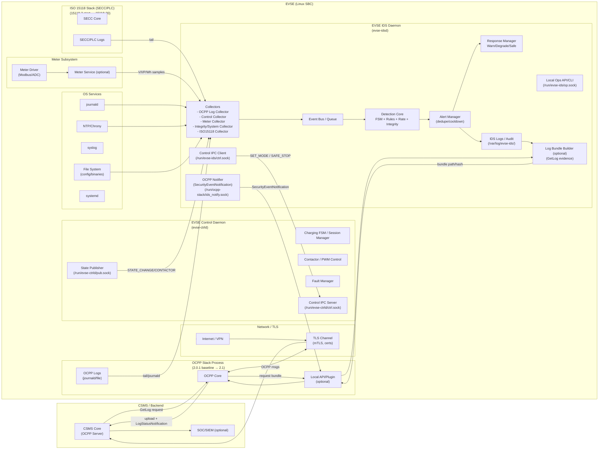

# EVSE IDS (Electric Vehicle Supply Equipment Intrusion Detection System)

## 1. 제품 개요

### 1.1 목적

EVSE(전기차 충전기)에서 발생 가능한 사이버 공격/오동작 징후를 실시간 탐지하고, 안전을 해치지 않는 범위에서 완화(Degrade/Safe) 및 증적(로그) 확보를 수행하는 경량 IDS를 제공한다.

### 1.2 적용 환경

*   **운영체제:** Linux SBC (예: Yocto/Ubuntu 기반)
*   **실행 형태:** systemd 서비스 (daemon)

## 2. 시스템 구성 (논리)

*   **EVSE IDS Daemon (evse-idsd)**
    *   Event Collector (어댑터)
    *   Detection Engine (Rule/FSM/Rate/Integrity)
    *   Response Manager
    *   Logging & Audit
    *   Local/Remote Interface

## 3. 기능 명세 (Functional Requirements)

### FR-01. 프로세스/서비스 동작

*   **FR-01-1:** `evse-idsd`는 `systemd`로 자동 기동/재기동 된다.
*   **FR-01-2:** 기동 시 설정 로드 → 무결성 검사 → 런타임 초기화 → 이벤트 수집 시작 순서로 동작한다.
*   **FR-01-3:** 비정상 종료 시 재시작 정책(예: `on-failure`)을 적용한다.

### FR-02. 이벤트 수집 (Collector) 공통

*   **FR-02-1:** IDS는 이벤트를 표준 포맷으로 내부 큐에 적재한다.
*   **FR-02-2:** 이벤트는 최소 다음 메타데이터를 포함한다: Timestamp, Source, EventType, EventCode, Payload (필드 제한).
*   **FR-02-3:** 이벤트 수집 실패 시에도 충전 제어 기능에 영향을 주지 않도록 비동기 처리한다.

### FR-03. EVSE 통신 이벤트 수집

*   **FR-03-1:** OCPP 이벤트를 수집한다 (최소: Boot/Authorize/StartTx/StopTx/Heartbeat/StatusNotification).
*   **FR-03-2:** 로컬 관리 인터페이스 (웹/REST/CLI) 접근 이벤트를 수집한다 (로그인 성공/실패, 설정 변경 요청).
*   **FR-03-3:** 네트워크 상태 이벤트를 수집한다 (DNS 변경, IP 변경, TLS 오류 등 선택).

### FR-04. 충전 상태 이벤트 수집

*   **FR-04-1:** 충전 세션 상태 이벤트를 수집한다 (예: IDLE/CONNECTED/AUTH/CHARGING/STOPPING/FAULT).
*   **FR-04-2:** 컨택터/릴레이 제어 이벤트 (ON/OFF/실패)를 수집한다.
*   **FR-04-3:** 안전 관련 Fault 신호 (과전류/과전압/온도/절연 등) 이벤트를 수집한다 (가능 범위).

### FR-05. 계측 (미터) 이벤트 수집

*   **FR-05-1:** 전압/전류/전력/에너지(Wh) 샘플을 주기적으로 수집한다.
*   **FR-05-2:** 샘플링 주기 및 측정 항목은 설정 가능해야 한다.
*   **FR-05-3:** 계측 데이터는 탐지용 최소 통계 (최근 N개 평균/최대/변화율) 계산을 지원한다.

### FR-06. 탐지 엔진 – FSM 기반 탐지

*   **FR-06-1:** IDS는 충전 세션 상태 머신 (FSM)을 유지한다.
*   **FR-06-2:** 허용되지 않은 상태 전이 발생 시 경보를 발생한다. (예: AUTH 없이 CHARGING 진입, STOPPING 없이 즉시 IDLE 등)
*   **FR-06-3:** FSM 위반은 기본적으로 Degrade 정책을 트리거할 수 있어야 한다.

### FR-07. 탐지 엔진 – 물리/계측 룰 기반 탐지

*   **FR-07-1:** 측정값 범위 위반 (전압/전류/전력/온도 등) 탐지를 제공한다.
*   **FR-07-2:** 변화율 (dP/dt 등) 기반 “급변” 탐지를 제공한다.
*   **FR-07-3:** 컨택터 상태와 계측 일관성 탐지를 제공한다. (예: 컨택터 OFF인데 유의미한 전력/전류가 감지)

### FR-08. 탐지 엔진 – OCPP/관리 기능 오남용 탐지 (레이트/패턴)

*   **FR-08-1:** API 호출 레이트 제한 탐지를 제공한다 (윈도우 카운팅 또는 토큰버킷).
*   **FR-08-2:** 인증 실패 반복 (브루트포스) 탐지를 제공한다.
*   **FR-08-3:** 고위험 OCPP 기능 호출 감지 및 정책 적용을 지원한다. (예: Reset, ChangeConfiguration, UpdateFirmware, SetNetworkProfile 등 (지원 범위 내))

### FR-09. 무결성 (Integrity) 탐지

*   **FR-09-1:** 설정 파일/중요 파일의 무결성 (해시)을 주기적으로 검사한다.
*   **FR-09-2:** 정상 관리 세션이 아닌데 설정 변경이 감지되면 경보를 발생한다.
*   **FR-09-3:** 펌웨어/애플리케이션 버전 롤백 (다운그레이드) 시도를 탐지한다 (가능 범위).

### FR-10. 경보 (Alert) 생성

*   **FR-10-1:** 탐지 시 Alert 객체를 생성한다 (Severity, RuleID, Summary, Evidence).
*   **FR-10-2:** Severity는 최소 3단계 (INFO/WARN/CRITICAL)로 구분한다.
*   **FR-10-3:** 동일 Alert의 폭주를 방지하기 위해 디듀플리케이션/쿨다운을 제공한다.

### FR-11. 대응 (Response) – 단계형 정책

*   **FR-11-1:** IDS는 정책에 따라 다음 대응을 수행할 수 있다.
    *   **Warn:** 로그/알림 전송
    *   **Degrade:** 관리 기능 제한 (예: 설정 변경 잠금, 업데이트 금지, 레이트 제한 강화)
    *   **Safe:** 안전 정지 플래그 (충전 제어 모듈이 정상 절차로 종료)
*   **FR-11-2:** Safe 대응은 “충전 중이면 안전 종료 절차 후 잠금”을 기본으로 한다.
*   **FR-11-3:** 대응은 충전 제어부와 느슨하게 결합 (플래그/IPC)되어야 한다.

### FR-12. 로깅/증적 (Audit Logging)

*   **FR-12-1:** IDS는 이벤트 및 Alert를 로컬에 저장한다.
*   **FR-12-2:** 저장 방식은 순환 로그 (링버퍼 또는 logrotate)를 지원한다.
*   **FR-12-3:** 로그 무결성 옵션 (해시체인 또는 서명)을 제공할 수 있다 (선택 기능).

### FR-13. 로컬 운영 인터페이스

*   **FR-13-1:** 로컬 상태 조회 (현재 상태, 최근 Alert, Degrade/Safe 상태)를 제공한다.
*   **FR-13-2:** 설정 변경은 인증된 사용자만 가능해야 한다.
*   **FR-13-3:** 운영 인터페이스는 CLI 또는 로컬 REST 중 최소 1개를 제공한다.

### FR-14. 원격 연동 (선택)

*   **FR-14-1:** IDS Alert를 중앙 서버로 전송할 수 있다 (syslog/TLS/HTTPS 중 택1).
*   **FR-14-2:** 전송 실패 시 로컬 큐에 보관 후 재전송한다 (백오프).

### FR-15. 구성/정책 관리

*   **FR-15-1:** 구성 파일 (예: YAML/JSON)로 룰/임계값/정책을 설정한다.
*   **FR-15-2:** 구성 변경 시 런타임 리로드 (SIGHUP 또는 API)를 지원한다 (선택).
*   **FR-15-3:** 구성 파일 접근 권한을 최소화하고 (파일 퍼미션), 변경 이력을 남긴다.

### FR-16. 성능/자원 제약

*   **FR-16-1:** IDS는 CPU/메모리 상한을 설정할 수 있어야 한다 (선택: cgroup/systemd).
*   **FR-16-2:** IDS 처리 지연이 충전 제어 실시간 요구를 침해하지 않도록 비동기/저우선순위로 동작한다.

## 4. 탐지 룰 ID 체계 (요구사항 수준 정의)

*   **FR-17-1:** 룰은 `EVSE-<DOMAIN>-<NNN>` 형식의 RuleID를 갖는다. (예: `EVSE-FSM-001` (상태 전이 위반), `EVSE-PWR-002` (전력 급변))

## 5. 최소 제공 산출물 (Deliverables)

*   **DS-01:** `evse-idsd` 바이너리/패키지
*   **DS-02:** 기본 정책 파일 (룰/임계값 포함)
*   **DS-03:** 운영 가이드 (설치/로그/알림 확인/튜닝)
*   **DS-04:** 룰 목록 및 테스트 시나리오 (기본)